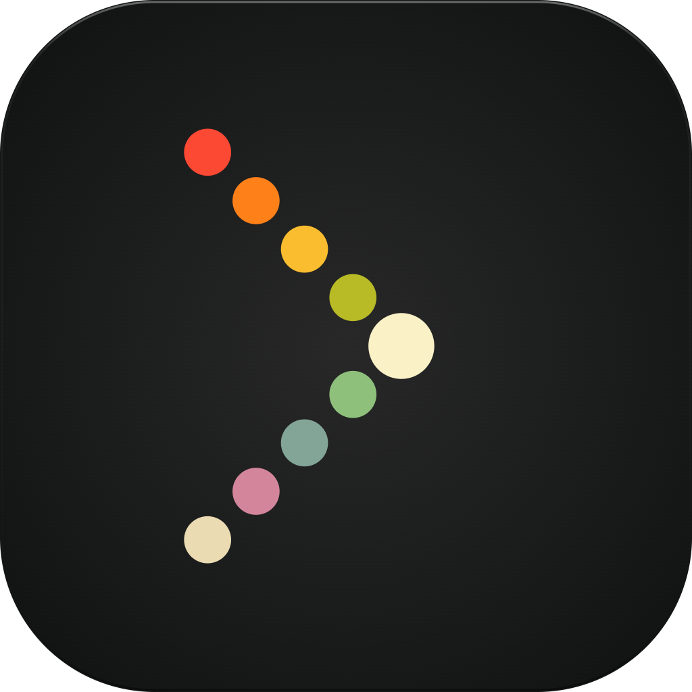

<p align="center">
  
</p>

# Blackbird

A minimal, native terminal emulator for macOS. AppKit + SwiftUI, Metal-rendered, no config files.

## What it is

- **macOS-only.** Built to feel like something Apple could have shipped.
- **Minimal.** Tabs, no splits. Preferences live in a single native window.
- **Accurate.** VT parsing via Rust's `alacritty_terminal` — the same engine as Alacritty and Zed.
- **Fast.** 120 Hz on ProMotion, low input-to-pixel latency, GPU-rendered.

Not interested in: cross-platform, splits, session restore, profiles, plugins, scripting, config files, AI, inline images.

## Highlights

- **Rendering.** Metal GPU renderer hitting native 120 Hz on ProMotion. Per-row caching redraws only what changed.
- **Terminal compatibility.** 24-bit color, Kitty keyboard protocol, synchronized output, bracketed paste, mouse reporting, focus events, 100k-line scrollback (lazily allocated). Five underline styles with independent colors (LSP squigglies work).
- **Tabs.** Native `NSWindow` tab groups, per-tab shell session, confirmation before closing multi-tab windows.
- **Input.** Full IME support for CJK, dead keys, trackpad pinch-to-zoom.
- **Find.** ⌘F regex search across scrollback; ⌘⌥E for replace.
- **URLs.** ⌘-click opens `http`/`https`/`ftp`/`mailto`. `file://` and other schemes are intentionally blocked — terminal output shouldn't be one click away from executing a local path. OSC 8 hyperlinks supported.
- **Clipboard.** ⌘C/⌘V with paste and copy scrubbing (strips C0 controls and Unicode bidi overrides). OSC 52 remote-clipboard writes are disabled by default; the Swift gate (size cap + scrub) is defense-in-depth if ever flipped on.
- **Drag-and-drop.** File paths dropped onto the terminal are shell-quoted and forwarded to the foreground child. C0 / DEL / bidi-override bytes are stripped before send.
- **Accessibility.** VoiceOver navigates the terminal by character, word, and line. `.textArea` contract pinned by tests.
- **Color emoji.** Apple Color Emoji and any third-party COLRv1 / sbix / CBDT font rasterizes through a dedicated `bgra8` atlas alongside the mono coverage atlas.
- **Themes.** Default, Gruvbox, Solarized, Catppuccin. Light/dark auto-follows the system.
- **Shell integration (opt-in).** Bundled OSC 133 snippets for bash/zsh/fish enable prompt-jumping with ⌘⇧↑/⌘⇧↓.
- **Fonts.** Hack Nerd Font Mono ships in the bundle. Any installed monospaced family is selectable.
- **Diagnostics.** Settings → Diagnostics surfaces hang reports and macOS crash reports with Copy / Reveal / Email actions. No upload, no SDK, no backend.
- **Auto-updates.** Sparkle 2.x, signed appcast.

## Keybindings

| Shortcut          | Action                           |
|-------------------|----------------------------------|
| ⌘T / ⌘N / ⌘W      | New tab / new window / close tab |
| ⌘1 … ⌘9           | Select tab 1–9                   |
| ⌘⇧[ / ⌘⇧]         | Previous / next tab              |
| ⌃⇥ / ⌃⇧⇥          | Cycle next / previous tab        |
| ⌘,                | Settings                         |
| ⌃⌘R               | Rename active tab                |
| ⌘C / ⌘V / ⌘A      | Copy / paste / select all (incl. scrollback) |
| ⌘K                | Clear viewport + scrollback      |
| ⌘F / ⌘G / ⌘⇧G     | Find / next / previous           |
| ⌘⌥E               | Replace (in Find bar)            |
| ⌘+ / ⌘− / ⌘0      | Font bigger / smaller / reset    |
| ⌘⇧↑ / ⌘⇧↓         | Jump to previous / next prompt   |
| ⌘-click URL       | Open in default browser          |
| ⌘-drag            | Move window                      |
| ⌘ + right-drag    | Resize from nearest corner       |

## Install

Download the signed, notarized DMG from
[blackbird-terminal.com](https://blackbird-terminal.com) or the
[Releases page](https://github.com/conjfrnk/blackbird/releases/latest).
Universal binary — Apple Silicon and Intel, macOS 14 Sonoma or newer.

Auto-updates ship through Sparkle once installed.

## Building

Requirements: macOS 14+, Xcode 16.2, Rust stable with both Apple targets, [`xcodegen`](https://github.com/yonaskolb/XcodeGen).

```sh
xcodegen generate
scripts/build-core.sh
xcodebuild -project Blackbird.xcodeproj -scheme Blackbird build
```

The Xcode target runs `build-core.sh` as a pre-build step, so `xcodebuild build` alone works after `xcodegen generate`.

## Tests

```sh
# Rust core
cargo fmt --all -- --check
cargo clippy -p blackbird_core --all-targets -- -D warnings
cargo test  -p blackbird_core --lib --tests

# Swift
xcodebuild test \
  -project Blackbird.xcodeproj \
  -scheme Blackbird \
  -destination 'platform=macOS,arch=arm64'
```

The Debug scheme enables ASan and UBSan. A cargo-fuzz target for the parser lives in [`core/fuzz/`](core/fuzz/README.md).

## Performance

CI gates on parser throughput (`plain_text` ≥ 25 MiB/s, `binary_garbage` ≥ 15 MiB/s, `ansi_log` ≥ 30 MiB/s over 64 MiB payloads) and long-session memory stability. Dev-machine numbers typically run 2–3× the floors.

See [`docs/benchmarks/vtebench-2026-04-20.md`](docs/benchmarks/vtebench-2026-04-20.md) for a cross-terminal throughput comparison (Terminal.app, iTerm2, Ghostty, Alacritty, Blackbird).

## Security and known issues

Vulnerability reporting and threat model: [`SECURITY.md`](SECURITY.md).
Known polish items deliberately deferred: [`KNOWN_ISSUES.md`](KNOWN_ISSUES.md).

## License

MIT.
